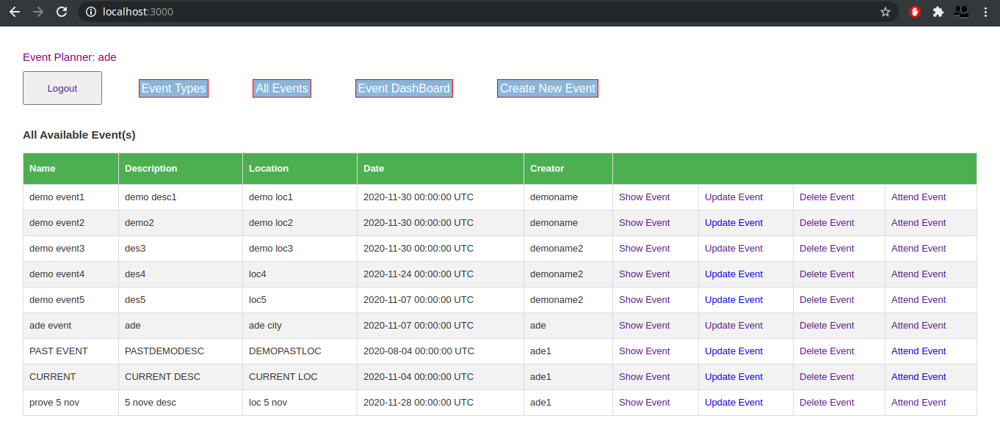

<br />
<p align="center">
  <a href="https://www.microverse.org/">
    
  </a>

  <h2 align="center">AUTHENTICATION: Private Events</h2>

  <p align="center">
    This project is part of the Microverse curriculum in Ruby on Rails module!
  </p>
</p>

## About The Project
In this project, you’ll be building a platform  where your members can create events and assist other events.



<!-- INSTALLATION -->
## Installation

You need to have this app or tools to start using it:
* [Ruby](https://www.ruby-lang.org/en/downloads/)
* [Rails](https://rubyonrails.org/)
* Clone this repo ```git clone https://github.com/AdesojiCodeMaster/private-events```
* Open terminal```cd``` to the cloned folder and install gems with ```bundle install```
* After gems install, run migrations ```bin/rake db:migrate```
* Run rails console ```bin/rails console```

### Usage

* First you have to start the server with "rails server"
* Once you have started the server, visit the browser at `http://localhost3000/` 

### Built With

* [Ruby](https://www.ruby-lang.org/en/downloads/)
* [Rails](https://rubyonrails.org/):
* [Rubocop](https://github.com/rubocop-hq/rubocop)
* [Stickler](https://stickler-ci.com/)

### Testing
##### Add the following gems to the 'development, :test' in the gemfile;
 * gem 'capybara', '~> 3.13'
 * gem 'factory_bot_rails'
 * gem 'pry-byebug'
 * gem 'rspec-rails'
 * gem 'shoulda-matchers'
 * gem 'webdrivers'

### Install the gems;

 * Run `bundle install` from the terminal.

 ### Run the test;

 * Run `rspec` from root of the folder using terminal.

## Authors
👤  **Juan Jacobo Hincapie Montes**

- Gmail: [jacobo12.montes@gmail.com](jacobo12.montes@gmail.com)
- Github: [@jacobo12.mont](https://github.com/jacobo12montes)
- Twitter: [@jacobo12.mont](https://twitter.com/HincapieMontes)
- Linkedin: [@jacobo12.mont](https://www.linkedin.com/in/juan-jacobo-hincapie-montes/)

👤 **Adesoji Adewumi**

- Github: [@AdesojiCodeMaster](https://github.com/AdesojiCodeMaster)
- Linkedin: [@adesoji-adewumi](https://www.linkedin.com/in/adesoji-adewumi)
- Twitter: [@codemas22665735](https://twitter.com/codemas22665735)

## 🤝 Contributing

Contributions, issues and feature requests are welcome!

Feel free to check the [issues page](https://github.com/AdesojiCodeMaster/private-events/issues).


## Acknowledgments

* [Microverse](https://www.microverse.org/)
* [The Odin Project](https://www.theodinproject.com/)


## 📝 License

This project is [MIT](lic.url) licensed.


## Show your support

Give a ⭐️ if you like this project!